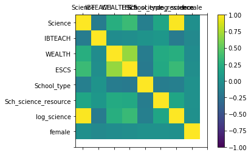
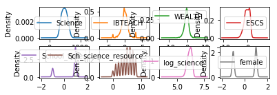
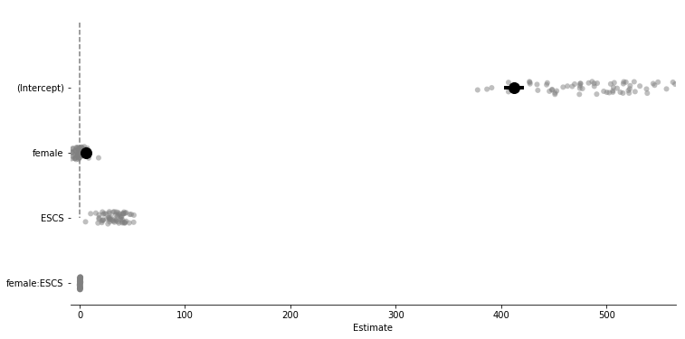
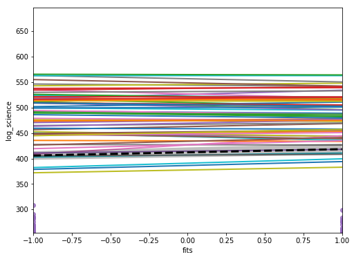
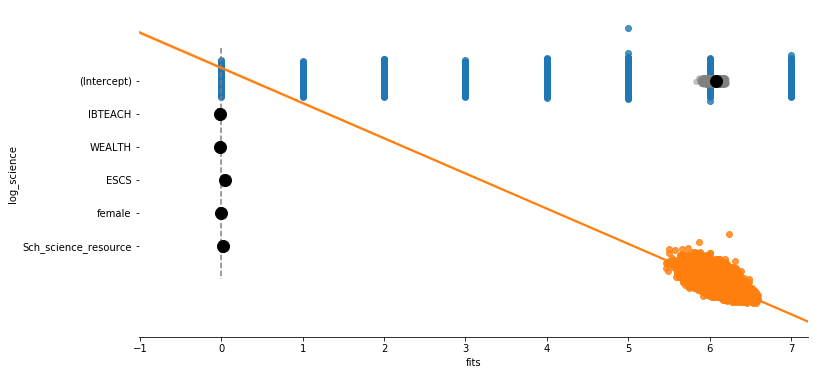
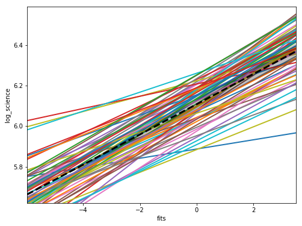
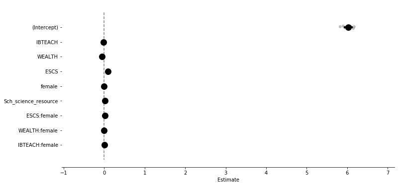
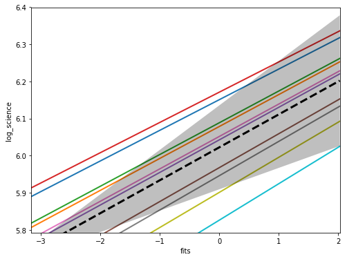
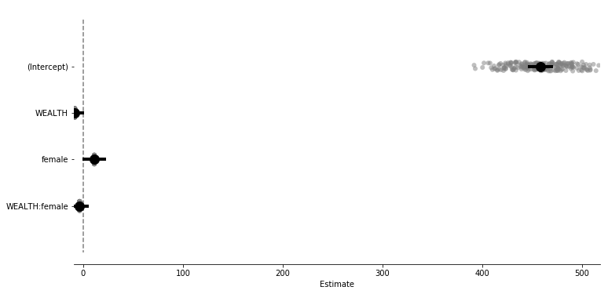

# PISAnalysisTool - Function Specification

## Background
Equity is a fundamental value and guiding principle of education policy, but it is not necessarily actualised in education systems around the world. In order to investigate educational equity in the difference of academic performance between gender groups, females and males, we collect international education data from the Internet. PISA is an international assessment of 15-year-old students’ capabilities in reading literacy, mathematics literacy, and science literacy as well as measuring a wider range of factors including students’ interest, attitudes and motivation. It is distributed across over 60 countries, and student background questionnaires and teacher questionnaires are collected as part of PISA assessment. Student scores vary greatly for different student subpopulations within a jurisdiction – e.g., gender. In this project, we are specifically interested in describing and explaining gender differences in students’ performances scores across countries. We hope to identify countries that have “equitable” schooling outcomes and their characteristics in education systems, including student and school culture, teacher educational practices, and societal factors. That said, we caution against simplistic international comparisons of country performances using correlates of higher performance in higher ranking countries for projecting causal generalizations and statements. 


## User profile

### Public users such as parents, teachers and students
To use PISA-WB analytic tool, public users such as parents, teachers and students should be able to have familiarity with operating graphical user interfaces (point, click, drop-down filters for interactive graphs).

### International organizations such as World Bank, UNESCO, International Association for Evaluation of Educational Achievement (IEA), Educational Testing Service (ETS)
Test experts, teachers, researchers specified in educational measurement and policies, and enthusiastic parents who are data-driven decision makers are welcome to use our analysis tool. Users are expected to know the basic commands of computing, especially in Jupyter Notebook, and make right responses for commands and interpretation. They should have some encounter with Jupyter Notebook which is optimal to enable sharing of notebooks with other colleagues for more in-depth analysis. Benefit of using Jupyter is that users can see the code as well as the actual results of running the code. It is especially helpful for the users to see some text/instructions mixed with the code in a notebook.  

### Education researchers and methodology experts
Education researchers and measurement experts should have in-depth knowledge of interpreting and using modeling results from hierarchical linear modeling. They should master certain level of data analysis in python language and common statistic packages. 


## Data sources

Datasets are downloadable from the following link:
PISA international: http://www.oecd.org/pisa/data/2015database/ 
	World Bank: http://datatopics.worldbank.org/education/indicators 
#### Original data sources:
* Student (STU): Student questionnaire data file in the most recent PISA 2015 dataset. 
* School (SCH): School questionnaire data file in the most recent PISA 2015 dataset.
* Teacher (TEA): Teacher questionnaire data file in the most recent PISA 2015 dataset.
* Economic social cultural status (ESCS): Rescaled indices of economic, social and cultural status for countries for trend analysis. Available in PISA 2012 dataset.
* Country equity indicator (CEI): Education equity indicators at the country level from World Bank data sets including Multiple Indicator Cluster Survey and Urban Informal Settlement Survey in year 2015. Selected series are education equality indicators such as total net attendance rate, lower secondary, gender parity index (GPI).
Three aspects of the design of PISA need careful attention in any analysis. The first stems from the sample design. Schools and students had unequal but known probabilities of selection. As a consequence, to generalize to the population sampled, analyses will need to apply the sampling weights provided in the file.

The second aspect to be considered also stems from the sampling design and bears on the calculation of standard errors. Since the sample design is a two-stage, stratified cluster design, we decide to do hierarchical linear modeling to account for the clusterness of the data.

Thirdly, PISA has special designs for student scores. PISA datasets include sets of five “plausible values” for each student for each overall subject area score and each subscale score. The plausible values are intended to represent the estimated distribution of scores of students similar to the given student in terms of responses to the assessment items and background questionnaire items. What this means for analyses is that, when it comes to statistics involving the achievement scores we use the approach of doing it five times, once for each plausible value, and then average the results.

A metadata of PISA student variable names is shown in the following: 


## Example: A multi-level modeling of science performance and gender effect


```python
import correlation as corrvisual
corrvisual.main()
```








```python
import importlib
import hlm_pymer4 as hpm
importlib.reload(hpm)
hpm.main()
```

    /home/rohit000/anaconda3/lib/python3.7/site-packages/rpy2/robjects/pandas2ri.py:191: FutureWarning: from_items is deprecated. Please use DataFrame.from_dict(dict(items), ...) instead. DataFrame.from_dict(OrderedDict(items)) may be used to preserve the key order.
      res = PandasDataFrame.from_items(items)


    Formula: Science ~ female + (female*ESCS | CountryID)
    
    Family: gaussian	 Inference: parametric
    
    Number of observations: 186394	 Groups: {'CountryID': 64.0}
    
    Log-likelihood: -1077355.186 	 AIC: 2154736.372
    
    Random effects:
    
                      Name       Var     Std
    CountryID  (Intercept)  7094.814  84.231
    CountryID       female    61.536   7.844
    CountryID         ESCS  1174.692  34.274
    CountryID  female:ESCS     0.355   0.596
    Residual                6105.794  78.140
    
                       IV1          IV2   Corr
    CountryID  (Intercept)       female -0.798
    CountryID  (Intercept)         ESCS  0.883
    CountryID  (Intercept)  female:ESCS  0.819
    CountryID       female         ESCS -0.807
    CountryID       female  female:ESCS -0.464
    CountryID         ESCS  female:ESCS  0.738
    
    Fixed effects:
    
    Formula: Science ~ female + (female*ESCS | CountryID)
    
    Family: gaussian	 Inference: parametric
    
    Number of observations: 186394	 Groups: {'CountryID': 64.0}
    
    Log-likelihood: -1077355.186 	 AIC: 2154736.372
    
    Random effects:
    
                      Name       Var     Std
    CountryID  (Intercept)  7094.814  84.231
    CountryID       female    61.536   7.844
    CountryID         ESCS  1174.692  34.274
    CountryID  female:ESCS     0.355   0.596
    Residual                6105.794  78.140
    
                       IV1          IV2   Corr
    CountryID  (Intercept)       female -0.798
    CountryID  (Intercept)         ESCS  0.883
    CountryID  (Intercept)  female:ESCS  0.819
    CountryID       female         ESCS -0.807
    CountryID       female  female:ESCS -0.464
    CountryID         ESCS  female:ESCS  0.738
    
    Fixed effects:
    
                 Estimate   2.5_ci  97.5_ci     SE      DF  T-stat  P-val  Sig
    (Intercept)   412.299  402.646  421.951  4.925  64.236  83.721    0.0  ***
    female          6.220    5.031    7.410  0.607  64.815  10.247    0.0  ***


    /home/rohit000/anaconda3/lib/python3.7/site-packages/scipy/stats/stats.py:1713: FutureWarning: Using a non-tuple sequence for multidimensional indexing is deprecated; use `arr[tuple(seq)]` instead of `arr[seq]`. In the future this will be interpreted as an array index, `arr[np.array(seq)]`, which will result either in an error or a different result.
      return np.add.reduce(sorted[indexer] * weights, axis=axis) / sumval


    Model failed to converge with max|grad| = 0.00297456 (tol = 0.002, component 1) 
    
    Formula: log_science ~ IBTEACH + WEALTH + ESCS + female + Sch_science_resource + (1 | SchoolID/CountryID)
    
    Family: gaussian	 Inference: parametric
    
    Number of observations: 186394	 Groups: {'CountryID:SchoolID': 14419.0, 'SchoolID': 14419.0}
    
    Log-likelihood: 79778.004 	 AIC: -159538.007
    
    Random effects:
    
                               Name    Var    Std
    CountryID:SchoolID  (Intercept)  0.007  0.081
    SchoolID            (Intercept)  0.011  0.104
    Residual                         0.021  0.144
    
    No random effect correlations specified
    
    Fixed effects:
    
    Formula: log_science ~ IBTEACH + WEALTH + ESCS + female + Sch_science_resource + (1 | SchoolID/CountryID)
    
    Family: gaussian	 Inference: parametric
    
    Number of observations: 186394	 Groups: {'CountryID:SchoolID': 14419.0, 'SchoolID': 14419.0}
    
    Log-likelihood: 79778.004 	 AIC: -159538.007
    
    Random effects:
    
                               Name    Var    Std
    CountryID:SchoolID  (Intercept)  0.007  0.081
    SchoolID            (Intercept)  0.011  0.104
    Residual                         0.021  0.144
    
    No random effect correlations specified
    
    Fixed effects:
    
                          Estimate  2.5_ci  97.5_ci     SE          DF    T-stat  \
    (Intercept)              6.075   6.069    6.080  0.003   14556.606  2254.813   
    IBTEACH                 -0.015  -0.016   -0.014  0.000  179429.792   -40.691   
    WEALTH                  -0.011  -0.012   -0.010  0.000  185101.967   -23.001   
    ESCS                     0.042   0.041    0.043  0.000  183270.569    84.412   
    female                  -0.006  -0.007   -0.006  0.000  179221.977   -16.585   
    Sch_science_resource     0.016   0.015    0.017  0.001   14000.789    30.983   
    
                          P-val  Sig  
    (Intercept)             0.0  ***  
    IBTEACH                 0.0  ***  
    WEALTH                  0.0  ***  
    ESCS                    0.0  ***  
    female                  0.0  ***  
    Sch_science_resource    0.0  ***  
    Multiple random effects clusters specified in model. Plotting the 1 one. This can be changed by passing 'ranef_idx = number'
    Formula: log_science ~ IBTEACH + WEALTH + ESCS + female + Sch_science_resource + female*ESCS + female*WEALTH + female*IBTEACH + (ESCS | CountryID)
    
    Family: gaussian	 Inference: parametric
    
    Number of observations: 186394	 Groups: {'CountryID': 64.0}
    
    Log-likelihood: 68151.331 	 AIC: -136276.662
    
    Random effects:
    
                      Name    Var    Std
    CountryID  (Intercept)  0.009  0.094
    CountryID         ESCS  0.000  0.018
    Residual                0.028  0.168
    
                       IV1   IV2   Corr
    CountryID  (Intercept)  ESCS  0.228
    
    Fixed effects:
    
    Formula: log_science ~ IBTEACH + WEALTH + ESCS + female + Sch_science_resource + female*ESCS + female*WEALTH + female*IBTEACH + (ESCS | CountryID)
    
    Family: gaussian	 Inference: parametric
    
    Number of observations: 186394	 Groups: {'CountryID': 64.0}
    
    Log-likelihood: 68151.331 	 AIC: -136276.662
    
    Random effects:
    
                      Name    Var    Std
    CountryID  (Intercept)  0.009  0.094
    CountryID         ESCS  0.000  0.018
    Residual                0.028  0.168
    
                       IV1   IV2   Corr
    CountryID  (Intercept)  ESCS  0.228
    
    Fixed effects:
    
                          Estimate  2.5_ci  97.5_ci     SE          DF   T-stat  \
    (Intercept)              6.108   6.085    6.131  0.012      64.904  518.956   
    IBTEACH                 -0.017  -0.017   -0.016  0.000  186330.747  -40.682   
    WEALTH                  -0.013  -0.014   -0.012  0.001  184730.141  -26.162   
    ESCS                     0.075   0.070    0.079  0.002      65.958   32.646   
    female                   0.001  -0.000    0.001  0.000  186282.256    1.614   
    Sch_science_resource     0.011   0.010    0.011  0.000  186364.965   51.874   
    ESCS:female             -0.001  -0.002    0.000  0.000  186309.762   -1.622   
    WEALTH:female            0.002   0.001    0.003  0.000  186286.648    4.081   
    IBTEACH:female           0.004   0.003    0.005  0.000  186276.681   10.300   
    
                          P-val  Sig  
    (Intercept)           0.000  ***  
    IBTEACH               0.000  ***  
    WEALTH                0.000  ***  
    ESCS                  0.000  ***  
    female                0.107       
    Sch_science_resource  0.000  ***  
    ESCS:female           0.105       
    WEALTH:female         0.000  ***  
    IBTEACH:female        0.000  ***  














Besides running the main function, users can also call a specific function and are able to specify a particular variable to see the visualization.


```python
import pandas as pd
import hlm_pymer4 as hpm
df = pd.read_csv('data/sample data.csv').groupby(['CountryID', 'SchoolID']).apply(
    lambda x: x.sample(frac=0.02, random_state=999)).reset_index(drop=True)
model_5_sci = hpm.mixeff_multinteraction2level_model(df)
model_sum_visual(model_5_sci, 'WEALTH', 'log_science')
```

    /home/rohit000/anaconda3/lib/python3.7/site-packages/rpy2/rinterface/__init__.py:146: RRuntimeWarning: singular fit
    
      warnings.warn(x, RRuntimeWarning)
    /home/rohit000/anaconda3/lib/python3.7/site-packages/rpy2/robjects/pandas2ri.py:191: FutureWarning: from_items is deprecated. Please use DataFrame.from_dict(dict(items), ...) instead. DataFrame.from_dict(OrderedDict(items)) may be used to preserve the key order.
      res = PandasDataFrame.from_items(items)


    singular fit 
    
    Formula: log_science ~ IBTEACH + WEALTH + ESCS + female + Sch_science_resource + female*ESCS + female*WEALTH + female*IBTEACH + (ESCS | CountryID)
    
    Family: gaussian	 Inference: parametric
    
    Number of observations: 273	 Groups: {'CountryID': 10.0}
    
    Log-likelihood: 57.322 	 AIC: -88.644
    
    Random effects:
    
                      Name    Var    Std
    CountryID  (Intercept)  0.014  0.119
    CountryID         ESCS  0.000  0.006
    Residual                0.036  0.189
    
                       IV1   IV2  Corr
    CountryID  (Intercept)  ESCS  -1.0
    
    Fixed effects:
    
    Formula: log_science ~ IBTEACH + WEALTH + ESCS + female + Sch_science_resource + female*ESCS + female*WEALTH + female*IBTEACH + (ESCS | CountryID)
    
    Family: gaussian	 Inference: parametric
    
    Number of observations: 273	 Groups: {'CountryID': 10.0}
    
    Log-likelihood: 57.322 	 AIC: -88.644
    
    Random effects:
    
                      Name    Var    Std
    CountryID  (Intercept)  0.014  0.119
    CountryID         ESCS  0.000  0.006
    Residual                0.036  0.189
    
                       IV1   IV2  Corr
    CountryID  (Intercept)  ESCS  -1.0
    
    Fixed effects:
    
                          Estimate  2.5_ci  97.5_ci     SE       DF   T-stat  \
    (Intercept)              6.023   5.909    6.136  0.058   17.221  104.403   
    IBTEACH                 -0.010  -0.032    0.011  0.011  260.731   -0.945   
    WEALTH                  -0.051  -0.076   -0.027  0.013  266.076   -4.080   
    ESCS                     0.089   0.058    0.120  0.016   66.163    5.592   
    female                  -0.002  -0.026    0.022  0.012  265.094   -0.189   
    Sch_science_resource     0.016   0.002    0.030  0.007  240.981    2.263   
    ESCS:female              0.019  -0.011    0.048  0.015  258.607    1.229   
    WEALTH:female           -0.009  -0.032    0.013  0.012  261.400   -0.821   
    IBTEACH:female           0.004  -0.018    0.025  0.011  261.497    0.343   
    
                          P-val  Sig  
    (Intercept)           0.000  ***  
    IBTEACH               0.345       
    WEALTH                0.000  ***  
    ESCS                  0.000  ***  
    female                0.850       
    Sch_science_resource  0.024    *  
    ESCS:female           0.220       
    WEALTH:female         0.412       
    IBTEACH:female        0.732       


    /home/rohit000/anaconda3/lib/python3.7/site-packages/scipy/stats/stats.py:1713: FutureWarning: Using a non-tuple sequence for multidimensional indexing is deprecated; use `arr[tuple(seq)]` instead of `arr[seq]`. In the future this will be interpreted as an array index, `arr[np.array(seq)]`, which will result either in an error or a different result.
      return np.add.reduce(sorted[indexer] * weights, axis=axis) / sumval


    ---------------------------------------------------------------------------

    TypeError                                 Traceback (most recent call last)

    <ipython-input-52-b751b572170d> in <module>()
          4     lambda x: x.sample(frac=0.02, random_state=999)).reset_index(drop=True)
          5 model_5_sci = hpm.mixeff_multinteraction2level_model(df)
    ----> 6 model_sum_visual(model_5_sci, 'WEALTH', 'log_science')
    

    TypeError: model_sum_visual() takes 2 positional arguments but 3 were given








## Now, let's look at how users can interact with our formula generator andn fun customized models on their own:

We will first import data. For illustration, here we sub-sample a small dataset.


```python
import pandas as pd
import seaborn as sns
from pymer4.models import Lmer
df = pd.read_csv('data/sample data.csv').groupby(['CountryID', 'SchoolID']).apply(
    lambda x: x.sample(frac=0.02, random_state=999)).reset_index(drop=True)
df.head()
```


<div>
<style scoped>
    .dataframe tbody tr th:only-of-type {
        vertical-align: middle;
    }

    .dataframe tbody tr th {
        vertical-align: top;
    }

    .dataframe thead th {
        text-align: right;
    }
</style>
<table border="1" class="dataframe">
  <thead>
    <tr style="text-align: right;">
      <th></th>
      <th>Unnamed: 0</th>
      <th>Unnamed: 0.1</th>
      <th>Unnamed: 0.1.1</th>
      <th>CountryID</th>
      <th>SchoolID</th>
      <th>StudentID</th>
      <th>Gender</th>
      <th>CountryName</th>
      <th>CountryCode</th>
      <th>Continent</th>
      <th>...</th>
      <th>Science</th>
      <th>IBTEACH</th>
      <th>WEALTH</th>
      <th>ESCS</th>
      <th>School_type</th>
      <th>Sch_science_resource</th>
      <th>log_science</th>
      <th>female</th>
      <th>z_sch_resource</th>
      <th>z_IBTEACH</th>
    </tr>
  </thead>
  <tbody>
    <tr>
      <th>0</th>
      <td>12461</td>
      <td>34745</td>
      <td>34745</td>
      <td>56</td>
      <td>5650027</td>
      <td>5651417</td>
      <td>Male</td>
      <td>Belgium - Rest of the country</td>
      <td>BEL</td>
      <td>EU</td>
      <td>...</td>
      <td>586.4260</td>
      <td>-1.0435</td>
      <td>-0.0739</td>
      <td>1.0494</td>
      <td>-1.0</td>
      <td>5.0</td>
      <td>6.374046</td>
      <td>-1</td>
      <td>0.119012</td>
      <td>-1.099643</td>
    </tr>
    <tr>
      <th>1</th>
      <td>13154</td>
      <td>36507</td>
      <td>36507</td>
      <td>56</td>
      <td>5650078</td>
      <td>5652526</td>
      <td>Female</td>
      <td>Belgium - Rest of the country</td>
      <td>BEL</td>
      <td>EU</td>
      <td>...</td>
      <td>684.0211</td>
      <td>-0.1798</td>
      <td>-0.6315</td>
      <td>-0.2282</td>
      <td>-1.0</td>
      <td>6.0</td>
      <td>6.527989</td>
      <td>1</td>
      <td>0.569286</td>
      <td>-0.246594</td>
    </tr>
    <tr>
      <th>2</th>
      <td>59526</td>
      <td>196764</td>
      <td>196764</td>
      <td>352</td>
      <td>35200004</td>
      <td>35203363</td>
      <td>Male</td>
      <td>Iceland</td>
      <td>ISL</td>
      <td>EU</td>
      <td>...</td>
      <td>474.4032</td>
      <td>-0.0748</td>
      <td>-0.5411</td>
      <td>1.1494</td>
      <td>1.0</td>
      <td>4.0</td>
      <td>6.162058</td>
      <td>-1</td>
      <td>-0.331262</td>
      <td>-0.142889</td>
    </tr>
    <tr>
      <th>3</th>
      <td>59801</td>
      <td>197384</td>
      <td>197384</td>
      <td>352</td>
      <td>35200034</td>
      <td>35202216</td>
      <td>Female</td>
      <td>Iceland</td>
      <td>ISL</td>
      <td>EU</td>
      <td>...</td>
      <td>593.7425</td>
      <td>0.2049</td>
      <td>0.2106</td>
      <td>1.6585</td>
      <td>1.0</td>
      <td>5.0</td>
      <td>6.386446</td>
      <td>1</td>
      <td>0.119012</td>
      <td>0.133362</td>
    </tr>
    <tr>
      <th>4</th>
      <td>59898</td>
      <td>197619</td>
      <td>197619</td>
      <td>352</td>
      <td>35200042</td>
      <td>35203996</td>
      <td>Male</td>
      <td>Iceland</td>
      <td>ISL</td>
      <td>EU</td>
      <td>...</td>
      <td>448.1137</td>
      <td>0.6256</td>
      <td>0.3800</td>
      <td>1.1325</td>
      <td>1.0</td>
      <td>5.0</td>
      <td>6.105047</td>
      <td>-1</td>
      <td>0.119012</td>
      <td>0.548873</td>
    </tr>
  </tbody>
</table>
<p>5 rows × 22 columns</p>
</div>


Then, we will create multi-level formula by importing `formula_creator` tool. Here's an example of selecting students' reading scores this time as an outcome variable, and specify interactions, fixed, and random effects.


```python
import formula_creator as mod
mod.main()
```

    Input outcome value:Reading
    
    Input level values one by one, "s" to stop:
    SchoolID
    CountryID
    s
    
    Interaction? (y/n)y
    Input interaction:
    Input first var:WEALTH
    Input second var:female
    Stop inputing? (y/n)y
    
    Fixed effect? (y/n)WEALTH
    
    Random effect? (y/n)female
    
    Want to input grand mean intercept? (y/n)n
    Lmer('Reading ~ WEALTH*female + (1|SchoolID/CountryID)')
    Random effect, 2-level, interation model


## Lmer('Reading ~ WEALTH*female + (1|SchoolID/CountryID)')

Now, we have created the formula as below. The users will need to copy-paste the formula and specify data in their own model. They would need to add `.fit(REML=False)` for the model to give estimation.


```python
trial = Lmer('Reading ~ WEALTH*female + (1|SchoolID/CountryID)', data = df)
trial.fit(REML=False)
```

    /home/rohit000/anaconda3/lib/python3.7/site-packages/rpy2/robjects/pandas2ri.py:191: FutureWarning: from_items is deprecated. Please use DataFrame.from_dict(dict(items), ...) instead. DataFrame.from_dict(OrderedDict(items)) may be used to preserve the key order.
      res = PandasDataFrame.from_items(items)


    Formula: Reading ~ WEALTH*female + (1|SchoolID/CountryID)
    
    Family: gaussian	 Inference: parametric
    
    Number of observations: 273	 Groups: {'CountryID:SchoolID': 224.0, 'SchoolID': 224.0}
    
    Log-likelihood: -1637.889 	 AIC: 3289.778
    
    Random effects:
    
                               Name       Var     Std
    CountryID:SchoolID  (Intercept)  2523.959  50.239
    SchoolID            (Intercept)  1223.756  34.982
    Residual                         6060.556  77.850
    
    No random effect correlations specified
    
    Fixed effects:
    


<div>
<style scoped>
    .dataframe tbody tr th:only-of-type {
        vertical-align: middle;
    }

    .dataframe tbody tr th {
        vertical-align: top;
    }

    .dataframe thead th {
        text-align: right;
    }
</style>
<table border="1" class="dataframe">
  <thead>
    <tr style="text-align: right;">
      <th></th>
      <th>Estimate</th>
      <th>2.5_ci</th>
      <th>97.5_ci</th>
      <th>SE</th>
      <th>DF</th>
      <th>T-stat</th>
      <th>P-val</th>
      <th>Sig</th>
    </tr>
  </thead>
  <tbody>
    <tr>
      <th>(Intercept)</th>
      <td>458.577</td>
      <td>445.969</td>
      <td>471.184</td>
      <td>6.433</td>
      <td>213.850</td>
      <td>71.290</td>
      <td>0.000</td>
      <td>***</td>
    </tr>
    <tr>
      <th>WEALTH</th>
      <td>-8.492</td>
      <td>-17.452</td>
      <td>0.469</td>
      <td>4.572</td>
      <td>271.639</td>
      <td>-1.857</td>
      <td>0.064</td>
      <td>.</td>
    </tr>
    <tr>
      <th>female</th>
      <td>11.073</td>
      <td>-0.656</td>
      <td>22.801</td>
      <td>5.984</td>
      <td>264.300</td>
      <td>1.850</td>
      <td>0.065</td>
      <td>.</td>
    </tr>
    <tr>
      <th>WEALTH:female</th>
      <td>-3.691</td>
      <td>-12.586</td>
      <td>5.204</td>
      <td>4.538</td>
      <td>267.432</td>
      <td>-0.813</td>
      <td>0.417</td>
      <td></td>
    </tr>
  </tbody>
</table>
</div>


### We can check up specific list of coeffients.


```python
trial.coefs
```


<div>
<style scoped>
    .dataframe tbody tr th:only-of-type {
        vertical-align: middle;
    }

    .dataframe tbody tr th {
        vertical-align: top;
    }

    .dataframe thead th {
        text-align: right;
    }
</style>
<table border="1" class="dataframe">
  <thead>
    <tr style="text-align: right;">
      <th></th>
      <th>Estimate</th>
      <th>2.5_ci</th>
      <th>97.5_ci</th>
      <th>SE</th>
      <th>DF</th>
      <th>T-stat</th>
      <th>P-val</th>
      <th>Sig</th>
    </tr>
  </thead>
  <tbody>
    <tr>
      <th>(Intercept)</th>
      <td>458.576618</td>
      <td>445.969024</td>
      <td>471.184212</td>
      <td>6.432564</td>
      <td>213.849570</td>
      <td>71.289865</td>
      <td>5.109954e-151</td>
      <td>***</td>
    </tr>
    <tr>
      <th>WEALTH</th>
      <td>-8.491573</td>
      <td>-17.451781</td>
      <td>0.468635</td>
      <td>4.571619</td>
      <td>271.638877</td>
      <td>-1.857454</td>
      <td>6.432868e-02</td>
      <td>.</td>
    </tr>
    <tr>
      <th>female</th>
      <td>11.072804</td>
      <td>-0.655574</td>
      <td>22.801181</td>
      <td>5.983976</td>
      <td>264.300271</td>
      <td>1.850409</td>
      <td>6.537051e-02</td>
      <td>.</td>
    </tr>
    <tr>
      <th>WEALTH:female</th>
      <td>-3.690702</td>
      <td>-12.585737</td>
      <td>5.204334</td>
      <td>4.538367</td>
      <td>267.431874</td>
      <td>-0.813222</td>
      <td>4.168139e-01</td>
      <td></td>
    </tr>
  </tbody>
</table>
</div>


```python
trial.ranef_var
```


<div>
<style scoped>
    .dataframe tbody tr th:only-of-type {
        vertical-align: middle;
    }

    .dataframe tbody tr th {
        vertical-align: top;
    }

    .dataframe thead th {
        text-align: right;
    }
</style>
<table border="1" class="dataframe">
  <thead>
    <tr style="text-align: right;">
      <th></th>
      <th>Name</th>
      <th>Var</th>
      <th>Std</th>
    </tr>
  </thead>
  <tbody>
    <tr>
      <th>CountryID:SchoolID</th>
      <td>(Intercept)</td>
      <td>2523.958941</td>
      <td>50.239018</td>
    </tr>
    <tr>
      <th>SchoolID</th>
      <td>(Intercept)</td>
      <td>1223.755513</td>
      <td>34.982217</td>
    </tr>
    <tr>
      <th>Residual</th>
      <td></td>
      <td>6060.556264</td>
      <td>77.849575</td>
    </tr>
  </tbody>
</table>
</div>


```python
trial.fixef
```


    [     (Intercept)    WEALTH     female  WEALTH:female
     0     490.833792 -8.491573  11.072804      -3.690702
     1     504.427429 -8.491573  11.072804      -3.690702
     2     453.878945 -8.491573  11.072804      -3.690702
     3     507.802614 -8.491573  11.072804      -3.690702
     4     476.191146 -8.491573  11.072804      -3.690702
     5     438.527215 -8.491573  11.072804      -3.690702
     6     478.729786 -8.491573  11.072804      -3.690702
     7     483.912414 -8.491573  11.072804      -3.690702
     8     407.875018 -8.491573  11.072804      -3.690702
     9     454.968589 -8.491573  11.072804      -3.690702
     10    496.226753 -8.491573  11.072804      -3.690702
     11    486.119793 -8.491573  11.072804      -3.690702
     12    430.715097 -8.491573  11.072804      -3.690702
     13    490.924392 -8.491573  11.072804      -3.690702
     14    448.898633 -8.491573  11.072804      -3.690702
     15    475.956719 -8.491573  11.072804      -3.690702
     16    476.100709 -8.491573  11.072804      -3.690702
     17    451.427922 -8.491573  11.072804      -3.690702
     18    500.799305 -8.491573  11.072804      -3.690702
     19    481.585169 -8.491573  11.072804      -3.690702
     20    499.023817 -8.491573  11.072804      -3.690702
     21    423.504879 -8.491573  11.072804      -3.690702
     22    458.988330 -8.491573  11.072804      -3.690702
     23    458.204129 -8.491573  11.072804      -3.690702
     24    475.875129 -8.491573  11.072804      -3.690702
     25    453.653911 -8.491573  11.072804      -3.690702
     26    458.704693 -8.491573  11.072804      -3.690702
     27    461.820289 -8.491573  11.072804      -3.690702
     28    477.929499 -8.491573  11.072804      -3.690702
     29    426.329597 -8.491573  11.072804      -3.690702
     ..           ...       ...        ...            ...
     194   432.898132 -8.491573  11.072804      -3.690702
     195   458.806888 -8.491573  11.072804      -3.690702
     196   417.017245 -8.491573  11.072804      -3.690702
     197   484.361002 -8.491573  11.072804      -3.690702
     198   474.822970 -8.491573  11.072804      -3.690702
     199   440.298457 -8.491573  11.072804      -3.690702
     200   422.049947 -8.491573  11.072804      -3.690702
     201   469.571393 -8.491573  11.072804      -3.690702
     202   428.569503 -8.491573  11.072804      -3.690702
     203   456.664276 -8.491573  11.072804      -3.690702
     204   449.273637 -8.491573  11.072804      -3.690702
     205   474.357426 -8.491573  11.072804      -3.690702
     206   434.105855 -8.491573  11.072804      -3.690702
     207   420.419457 -8.491573  11.072804      -3.690702
     208   445.405772 -8.491573  11.072804      -3.690702
     209   445.695496 -8.491573  11.072804      -3.690702
     210   458.325264 -8.491573  11.072804      -3.690702
     211   463.326272 -8.491573  11.072804      -3.690702
     212   482.370212 -8.491573  11.072804      -3.690702
     213   415.134949 -8.491573  11.072804      -3.690702
     214   470.105751 -8.491573  11.072804      -3.690702
     215   465.665379 -8.491573  11.072804      -3.690702
     216   452.230524 -8.491573  11.072804      -3.690702
     217   423.767273 -8.491573  11.072804      -3.690702
     218   413.162694 -8.491573  11.072804      -3.690702
     219   428.195011 -8.491573  11.072804      -3.690702
     220   391.875945 -8.491573  11.072804      -3.690702
     221   400.313538 -8.491573  11.072804      -3.690702
     222   421.620063 -8.491573  11.072804      -3.690702
     223   466.652819 -8.491573  11.072804      -3.690702
     
     [224 rows x 4 columns],      (Intercept)    WEALTH     female  WEALTH:female
     0     474.216688 -8.491573  11.072804      -3.690702
     1     480.807638 -8.491573  11.072804      -3.690702
     2     456.298925 -8.491573  11.072804      -3.690702
     3     482.444116 -8.491573  11.072804      -3.690702
     4     467.117120 -8.491573  11.072804      -3.690702
     5     448.855554 -8.491573  11.072804      -3.690702
     6     468.347994 -8.491573  11.072804      -3.690702
     7     470.860820 -8.491573  11.072804      -3.690702
     8     433.993666 -8.491573  11.072804      -3.690702
     9     456.827245 -8.491573  11.072804      -3.690702
     10    476.831495 -8.491573  11.072804      -3.690702
     11    471.931079 -8.491573  11.072804      -3.690702
     12    445.067805 -8.491573  11.072804      -3.690702
     13    474.260616 -8.491573  11.072804      -3.690702
     14    453.884193 -8.491573  11.072804      -3.690702
     15    467.003457 -8.491573  11.072804      -3.690702
     16    467.073271 -8.491573  11.072804      -3.690702
     17    455.110533 -8.491573  11.072804      -3.690702
     18    479.048522 -8.491573  11.072804      -3.690702
     19    469.732442 -8.491573  11.072804      -3.690702
     20    478.187667 -8.491573  11.072804      -3.690702
     21    441.571891 -8.491573  11.072804      -3.690702
     22    458.776239 -8.491573  11.072804      -3.690702
     23    458.396015 -8.491573  11.072804      -3.690702
     24    466.963897 -8.491573  11.072804      -3.690702
     25    456.189816 -8.491573  11.072804      -3.690702
     26    458.638716 -8.491573  11.072804      -3.690702
     27    460.149330 -8.491573  11.072804      -3.690702
     28    467.959970 -8.491573  11.072804      -3.690702
     29    442.941471 -8.491573  11.072804      -3.690702
     ..           ...       ...        ...            ...
     194   446.126261 -8.491573  11.072804      -3.690702
     195   458.688266 -8.491573  11.072804      -3.690702
     196   438.426325 -8.491573  11.072804      -3.690702
     197   471.078320 -8.491573  11.072804      -3.690702
     198   466.453752 -8.491573  11.072804      -3.690702
     199   449.714350 -8.491573  11.072804      -3.690702
     200   440.866459 -8.491573  11.072804      -3.690702
     201   463.907496 -8.491573  11.072804      -3.690702
     202   444.027502 -8.491573  11.072804      -3.690702
     203   457.649408 -8.491573  11.072804      -3.690702
     204   454.066016 -8.491573  11.072804      -3.690702
     205   466.228031 -8.491573  11.072804      -3.690702
     206   446.711832 -8.491573  11.072804      -3.690702
     207   440.075907 -8.491573  11.072804      -3.690702
     208   452.190660 -8.491573  11.072804      -3.690702
     209   452.331135 -8.491573  11.072804      -3.690702
     210   458.454747 -8.491573  11.072804      -3.690702
     211   460.879514 -8.491573  11.072804      -3.690702
     212   470.113074 -8.491573  11.072804      -3.690702
     213   437.513683 -8.491573  11.072804      -3.690702
     214   464.166582 -8.491573  11.072804      -3.690702
     215   462.013643 -8.491573  11.072804      -3.690702
     216   455.499679 -8.491573  11.072804      -3.690702
     217   441.699114 -8.491573  11.072804      -3.690702
     218   436.557425 -8.491573  11.072804      -3.690702
     219   443.845927 -8.491573  11.072804      -3.690702
     220   426.236426 -8.491573  11.072804      -3.690702
     221   430.327440 -8.491573  11.072804      -3.690702
     222   440.658027 -8.491573  11.072804      -3.690702
     223   462.492409 -8.491573  11.072804      -3.690702
     
     [224 rows x 4 columns]]


### Here's a way to see model summary visualization.


```python
trial.plot_summary()
```

    Multiple random effects clusters specified in model. Plotting the 1 one. This can be changed by passing 'ranef_idx = number'


    <matplotlib.axes._subplots.AxesSubplot at 0x7fa334016e80>




